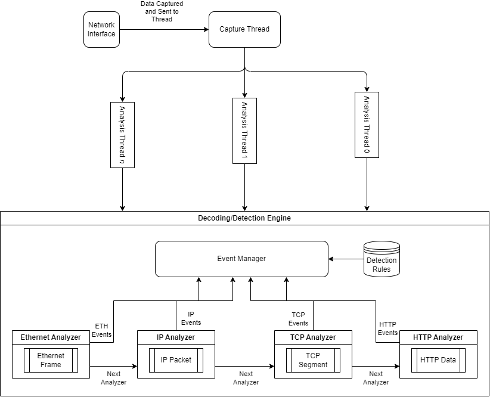

+++
date = '2026-03-17T09:50:57-04:00'
draft = false
title = 'NIDS 00 - An Introduction'
weight = 1
+++
 

    <a class="link-button" href="../">Article Home</a>
    <a class="link-button" href="../article-02">Next</a>

 

### Table of Contents
1. Introduction & Goals
2. Features
3. Development
4. Analysis Pipeline
5. Next Steps

### Introduction
Network Intrusion Detection Systems (NIDS) and Prevention Systems (NIPS) are an important part of the in-depth defense of an organization. These are systems that analyze networking traffic, apply some sort of detection logic, and in some cases, actively block network traffic deemed malicious.

Many years ago, I developed an IDS which I called 'Vigil' (as in 'a period of observation/surveillance') and later renamed it to 'NSense'. This was one of my very first programming projects that were not simple scripts or experiments. While I cannot attest to the quality of the previous project, it most certainly helped me learn a lot of what I know today. 

This series of articles aims to redevelop the previous system by applying what I have learned over the last 6 years.

The goals, therefore, of this project are:
1. Incorporate a multi-threaded analysis pipeline
2. Develop a more powerful decoding system
3. Re-write the detection engines, particularly the rule and conversation tracking engines
4. Event driven analysis

### Features
Some specific features I would like to implement throughout this series of articles are:
1. UDP Decoding - This was a major deficit of NSense
2. Conversation Analysis
3. Flow Analysis (e.g. for detecting beaconing)
4. Custom Rule Language - likely based on Snort's
5. Event driven analysis - network traffic should be treated as a stream of events containing data, not data alone
6. Aho-Corasick Search Algorithm
7. NFA-Based Regex Implementation
8. Analysis of PCAP Files

### Development
This table outlines the tools that will be used for this project.

<table>
    <colgroup>
        <col >
        <col>
    </colgroup>
    <thead>
        <th scope="col">Feature</th>
        <th scope="col">Tool</th>
    </thead>
    <tbody>
        <tr>
            <td>Primary Language</td>
            <td>C++20</td>
        </tr>
        <tr>
            <td>Build System</td>
            <td>CMake</td>
        </tr>
        <tr>
            <td>Packet Capture</td>
            <td><code>libpcap</code> or perhaps raw sockets</td>
        </tr>
        <tr>
            <td>Rule DSL</td>
            <td>Either hand written or using <code>bison</code> and <code>flex</code></td>
        </tr>
    </tbody>
</table>

#### Analysis Pipeline

The analysis pipeline will consist of the following steps:
1. Capture a frame from an interface (capture thread)
2. Queue this frame for analysis
3. A worker/analysis thread picks up with the work
4. This thread starts decoding process, which consists of extract each sub-protocol from the frame
5. For each protocol, an event is created indicating that it was found
6. Also for each protocol, preliminary analysis is done by the decoder itself. If it finds, for example, a TCP packet with no or all flags set, it might create an event indicating that.
7. Event Handlers for the various events will determine what happens next. This might be logging, blocking, etc.

Here is a diagram illustrating this:

#### Next Steps

The next article will cover setting up libpcap and analysis threads.

    <a class="link-button" href="../">Article Home</a>
    <a class="link-button" href="../article-02">Next</a>

