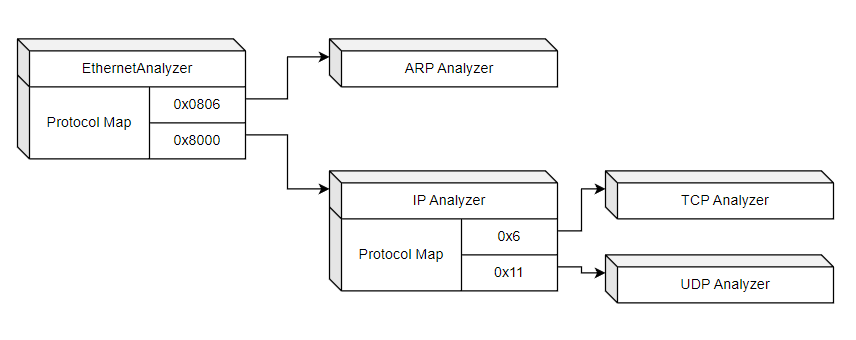

+++
date = '2026-03-21T11:47:37-04:00'
draft = false
title = 'NIDS 01 - Setting Up Packet Capture and Threading'
weight = 2
+++
<br>
<div>
    <a class="link-button" href="../article-01">Prev</a>
    <a class="link-button" href="../">Article Home</a>
    <a class="link-button" href="../article-03/">Next</a>
</div>
<br>

### Table Of Contents
1. Creating a simple decoding pipeline
2. Setting up a capture session and thread
3. Beginning the Analysis Pipeline
4. Next Steps

#### Packet Analyzers and the Protocol Manager
In my previous project, Vigil, I developed a relatively naive solution to the problem of associating protocols with analyzers. That is, each protocol decoding function (aptly named otherwise to confuse future readers of the code base), simply contained a massive switch statement:
```c++
switch (ip_header->protocol)
{
    case 0x1: 
        ip4_icmp_decode(...);
        break;
    case 0x2:
        ip4_igmp_decode(...);
        break;
}
```
One aim of this project is to solve that.
##### Analyzers

An analyzer derives from the `sensor::Analyzer` base class and contains a `sensor::tag_t`, a 64 bit integer identifying the analyzer. The tag ideally would be a set of no more than 8 characters, such as `'ethernet'`. This fits nicely within a `uint64_t`; however the compiler doesn't necessarily appreciate it. I got the idea of using this from having developed fairly basic drivers using the WDK. There is a function called `ExAllocatePoolWithTag` that uses this exact technique.

Here is the layout of the `Analyzer` class:
```c++
class ProtocolManager;


#define ANALYZER_TAG(name)                                                  \
    public:                                                                 \
        static constexpr tag_t GetStaticTag() { return (uint64_t)name; }    \
        tag_t getTag() override { return (uint64_t)name; }

class Analyzer
{
public:
    Analyzer();
    virtual ~Analyzer() {}
    virtual bool analyze(const PacketData& pd, const unsigned char* data, unsigned int length) = 0;
    virtual tag_t getTag() = 0;
private:
    friend class ProtocolManager;
    void addAssociation(uint64_t protocol, std::shared_ptr<Analyzer>& analyzer);
protected:
    std::unordered_map<uint64_t, std::weak_ptr<Analyzer>> m_protoMap;
};
```

The analyze function is a critical part of this class. It takes a `PacketData` - which may in the future be replaced with a `std::span` or something similar - which contains a pointer to the very base of the packet and total length. `data` and `length` refer only to subsections of `PacketData`. For example, as seen below when we discuss analyzing the ethernet protocol, the `data` and `length` of the next protocol, regardless of what it might be, are adjusted so that they respectively point to and describe the next protocol,  while preserving the original packet in the `PacketData`.

Finally, the protocol map serves to, alongside the `ProtocolManager`, map protocol specific protocol numbers to their respective analyzers. These analyzers use `weak_ptr`s because they shouldn't be storing a hard reference to any other analyzer. This could cause issues if we need to decode embedded protocols. For example, an IP tunnelling analyzer might have a pipeline that looks like this: `Ethernet -> IP -> IP Tunnel -> IP -> TCP -> ...`. If we stored `shared_ptr`s to and from each of these protocols, we would have a circular reference cycle; there would be no way for certain reference counts to reach zero, and we could thus leak memory.

##### The Protocol Manager
The protocol manager does two things:
1. It stores instances of analyzers
2. It helps associate one analyzer with another given a protocol number.

The protocol manager contains a mapping of `tag_t` to `Analyzer` and for each new association, updates the parent `Analyzer`'s protocol map. In the end, it is reminiscent of a graph.

To begin with, I defined a `concept` to ensure that only valid `Analyzer`s are given to the templated functions of the `ProtocolManager`:
```c++
template <class T>
concept ValidAnalyzer = requires(T t)
{
    std::derived_from<T, Analyzer>; // is a sub class
    std::same_as<decltype(T::GetStaticTag()), tag_t>; // ANALYZER_TAG was used
};
```

Next I added two functions to the `ProtocolManager`: one for registering `Analyzer`s and another for associating them:

```c++
class ProtocolManager
{
public:
    ProtocolManager() : m_analyzers{} {}

    template <ValidAnalyzer T>
    [[maybe_unused]] std::shared_ptr<Analyzer> registerAnalyzer()
    {
        auto iter = m_analyzers.find(T::GetStaticTag());
        if (iter != m_analyzers.end())
            return iter->second;

        auto ptr = std::make_shared<T>();

        m_analyzers[T::GetStaticTag()] = ptr;

        return std::static_pointer_cast<Analyzer>(ptr);
    }

    template <ValidAnalyzer Parent, ValidAnalyzer Child>
    void addAssociation(uint64_t protocol)
    {
        std::shared_ptr<Analyzer> parent = registerAnalyzer<Parent>();
        std::shared_ptr<Analyzer> child =  registerAnalyzer<Child>();

        parent->addAssociation(protocol, child);
    }
private:
    std::unordered_map<tag_t, std::shared_ptr<Analyzer> > m_analyzers;
};
```

While this is likely to change in the future, especially if any type of configuration via file is to be done, it is suitable for now:

```c++
    auto pm = std::make_shared<ProtocolManager>();
    pm->addAssociation<EthernetAnalyzer, IPAnalyzer>(0x8);
    pm->addAssociation<IPAnalyzer, TCPAnalyzer>(0x6);
```
#### The Capture Session

A `CaptureSession` encapsulates all information related to a specific instance of a `libpcap` capture loop (`pcap_loop`) including the thread upon which it is running. With this setup, and a manager class for it (not covered here), we could conceivably have an array of `CaptureSession`s, one per relevant interface. Furthermore, the `CaptureSession` receives a pointer to a protocol manager.

The `CaptureSession` starts by obtaining a handle from `libpcap` to the target network interface:
```c++
CaptureSession::CaptureSession(const char* device, std::shared_ptr<ProtocolManager> pm)
    : m_handle{ nullptr },
    m_protomgr{ pm },
    m_capDev{ device },
    m_captureThread{ }
{
    char errbuf[PCAP_ERRBUF_SIZE] = { 0 };
    m_handle = pcap_open_live(device, BUFSIZ, 1, 1000, errbuf);
    if (!m_handle)
        printf("Failed to open %s for capture: %s\n", device, errbuf);
}

CaptureSession::~CaptureSession()
{
    if (m_handle)
    {
        pcap_close(m_handle);
        m_handle = nullptr;
    }
}

bool CaptureSession::isReady() const { return m_handle != nullptr; }
```

With this we can be capturing packets. There are a couple of ways to do this. One is via `pcap_next`, this is a very manual process; the other is `pcap_loop`, this takes a callback and does quite a bit of work for you. I will be using the latter and running it on a separate thread.
```c++
void PcapLoopFunction(u_char* args, const pcap_pkthdr* hdr, const u_char* pkt)
{
    CaptureSession* session = reinterpret_cast<CaptureSession*>(args);
    session->nextPacket(args, hdr, pkt);
}
```
Next I defined a `beginCapture` function that constructs a lambda calling `pcap_loop`:
```c++
void CaptureSession::beginCapture()
{
    m_captureThread = std::thread(
        [](CaptureSession* session) {
            pcap_loop(session->m_handle, -1, PcapLoopFunction, reinterpret_cast<u_char*>(session));
        },
        this
    );
}
```
The casting is an unpleasant but necessary requirement for `libpcap`. It is a C library - there is no extensive type information and no templating that would allow for a completely type-safe implementation, but it *is* the lowest common denominator. Therefore we must cast the pointer to our `CaptureSession*` to a `u_char*` and then back to a `CaptureSession*`.

#### Beginning the Analysis Pipeline
In `PcapLoopFunction`, there is a call to `CaptureSession::nextPacket`. This is the entry to the decoding and analysis pipeline. 

```c++
void CaptureSession::nextPacket(u_char* args, const pcap_pkthdr* header, const u_char* packet)
{
    PacketData pd = {
        .data = packet,
        .length = header->len
    };

    auto ethAnalyzer = m_protomgr->getAnalyzer('eth');

    ethAnalyzer->analyze(pd, packet, header->len);
}
```

The entire pipeline looks something like this:



##### Decoding Ethernet, IPv4, and TCP
The way to decode protocols with static data layouts like these three (and many others) is fairly simple. Once you receive a packet (in the form of `unsigned char*`) from `libpcap`, different parts of it can be type cast to `struct`s representing the protocol. Here is the one for ethernet:
```c++
struct EthHdr
{
    uint8_t dest[6];
    uint8_t src[6];
    uint16_t proto;
};
```

And in `EthernetAnalyzer` it is cast like so:
```c++

bool EthernetAnalyzer::analyze(
    const PacketData& pd,
    const unsigned char* data,
    const unsigned int length
)
{
    const EthHdr* header = reinterpret_cast<const EthHdr*>(data);

    const auto* nextProtocolData = data + sizeof(EthHdr);
    const auto* nextProtoDataSize = length - sizeof(EthHdr);

    if (m_protoMap.contains(header->proto))
    {
        auto analyzer = m_protoMap[header->proto].lock();
        analyzer->analyze(pd, nextProtocolData, nextProtoDataSize);
    }
    else 
    {
        // indicate that an unknown or unmapped protocol has been encountered
    }
    return true;
}

```

This is essentially repeated in the IP and TCP analyzers; no in-depth analysis is currently being performed.

#### Next Steps

Now that we have a way to create a complex decoding pipeline, we can begin to perform analysis of these protocols. Next steps include, in no particular order as of yet:
1. Debug and Packet Printing - I would like a way to easily turn on/off packet printing
2. Event Manager/Bus - When *something* is encountered in a packet, including the packet itself, an event should be created and a handler called
3. More standardized error handling - Right now there is none - only returning true/false

<br>
<div>
    <a class="link-button" href="../article-01">Prev</a>
    <a class="link-button" href="../">Article Home</a>
    <a class="link-button" href="../article-03/">Next</a>
</div>
<br>