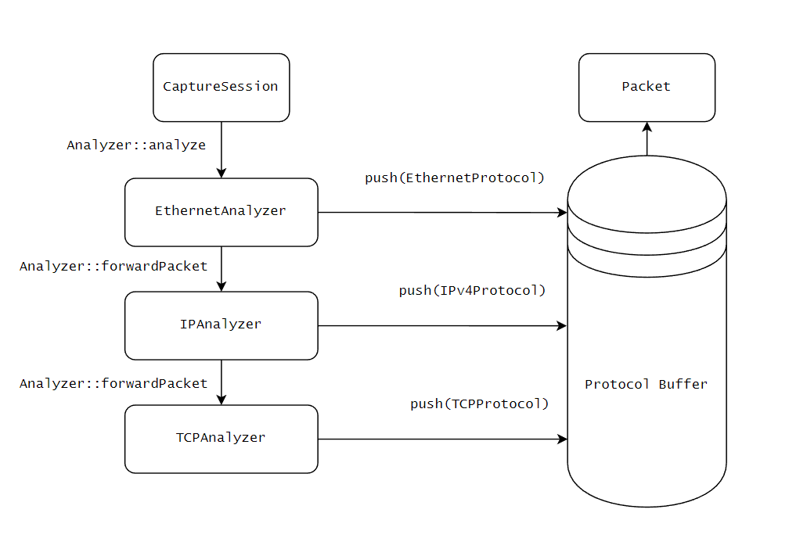
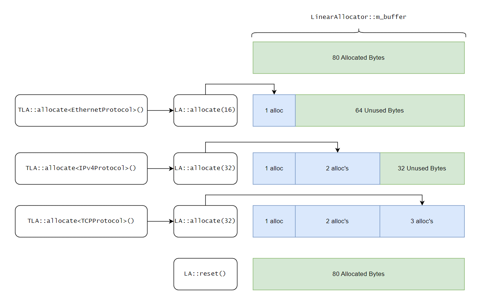
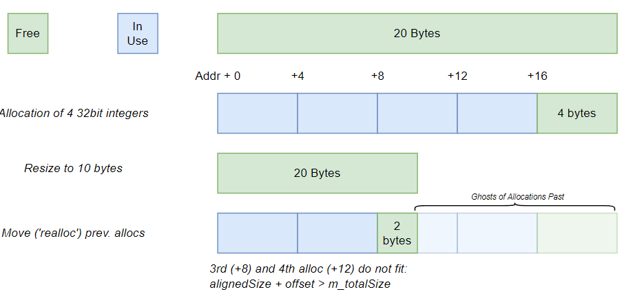
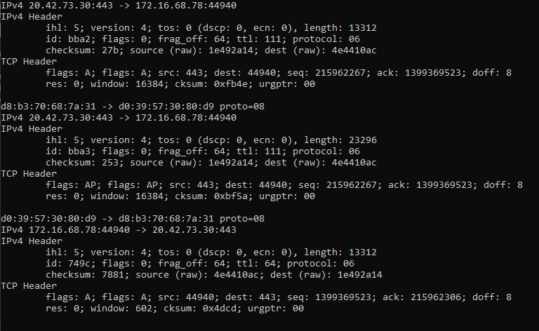
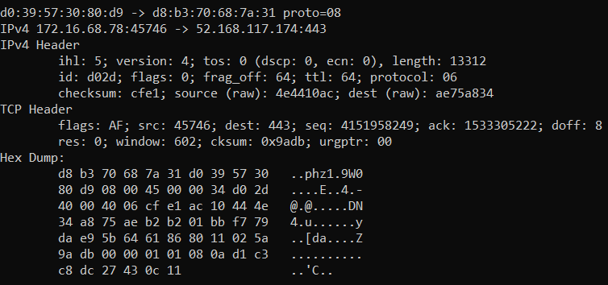

+++
date = '2026-04-01T10:02:20-04:00'
draft = false
weight = 3
title = 'NIDS 02 - New Decoding Design and Memory Allocation'
+++
<br>
<div>
    <a class="link-button" href="../article-02">Prev</a>
    <a class="link-button" href="../">Article Home</a>
    <!-- <a class="link-button" href="">Next</a> -->
</div>
<br>

### Table of Contents
1. [Analysis and Decoding Infrastructure](#analysis-and-decoding-infrastructure)
2. [Linear Memory Allocation](#linear-memory-allocation)
3. [Dumping Packets to the Console](#dumping-packets-to-the-console)

### Analysis and Decoding Infrastructure {id=analysis-and-decoding-infrastructure}
In the previous article I discussed a method analysis/decoding involving a base `sensor::Analyzer` class. This alone is not sufficient for our goals. Ideally, when the rule language - which hasn't been discussed much up to this point - is complete, we could have rules like this:
```snort
alert http $externalnet:any -> $homenet:any {
    message: "Some Message Here";
    tcp.flags:"ASFRP";
    ip.ttl: 2;
}
```
Or even rules with function calls: 
```
http.headers.contains("Content-Type: application/malware")
```
Furthermore, we need a way to print packets to the console. To facilitate the latter and prepare for the former, I have defined a system wherein each protocol has defined for it a subclass of `sensor::Analyzer` and a subclass of `sensor::Protocol`. The `Analyzer` class receives the raw packet data, parses it and sets information in the `Protocol` class. This system is surely due to change and I expect in the future, `Analyzer` will act more like a router so the respective `Protocol`s can parse their data. 

Right now the `Protocol` class contains only a function for string conversion:
```c++
class Protocol
{
public:
    virtual ~Protocol() = default;

    virtual std::string toString(const Packet& packet, Verbosity v) const = 0;
};
```

Next, the previous design had `Analyzer` subclasses doing the heavy work of forwarding packets themselves:
```c++
bool IPAanlyzer::analyze(...) 
{
    ...
    if (m_protoMap.contains(iphdr->protocol))
    {
        auto next = m_protoMap[iphdr->protocol];
        next.lock()->analyze(packet, protoRegion);
    }
    ...
}
```
The new design puts this responsibility, although it can be overridden, in the base `Analyzer` class:
```c++
class Analyzer
{
    ...
public:
    virtual bool forwardPacket(Packet& packet, uint64_t protocol, const PacketRegion& subProtoRegion);
    ...
};
    ...
bool IPAnalyzer::analyze(...)
{
    ...
    return forwardPacket(packet, iphdr->protocol, protoRegion);
    ...
}
```
Finally, the decoded protocols are stored in an allocator, which is owned by `Packet`. The overall flow looks like this:


### Linear Memory Allocation {id=linear-memory-allocation}
The allocator used by `Packet` is a Linear or Arena allocator. This solves a very important problem that would assuredly cause more problems in the future: polymorphism is handled at the pointer and reference level (i.e. vtables). Storing a list of decoded `Protocol`s using an STL container would look something like this:
```c++
std::vector<Protocol*>
// or
std::vector<std::shared_ptr<Protocol>>
```
There is nothing inherently wrong with this...except for the fact that this usually requires heap memory allocation. This would heap allocate memory several times *per packet*.

The solution I came up with was a Linear Allocator. While not quite as type-safe, it solves the problem at hand. The Linear Allocator would allocate one gigantic buffer, then 'suballocate' chunks of that buffer, one after the other (hence *linear*). One problem with this system is that it by itself does not provide a way to track allocations. This would not be a problem in a pool allocator, which is essentially a (potentially fragmented) dynamic array. Another is that it cannot safely store types that have a destructor defined (i.e. *not* `std::is_trivially_destructible`). To solve these, I designed a wrapper around this called a Tracked Linear Allocator. This will store not only a pointer to the allocated object but also a pointer to a deleter function to destroy it if necessary.

Here is a diagram of the linear allocator (TLA = `TrackedLinearAllocator`):


The final issue solved by the `TrackedLinearAllocator` is that the `LinearAllocator` cannot be resized safely. Pointers to and within allocations would be invalid and cause a segmentation fault or logic errors depending on how the invalid data is used. `TrackedLinearAllocator` allows this to be solved by its very nature - tracking allocations.

#### `sensor::LinearAllocator`
This is the easy part. Its sole responsibility is to calculate and align a pointer into the buffer and return it. The complicated part of this is memory alignment. 

##### Memory Alignment
Processors can only access memory within their word boundaries; on x86_64 systems, this is 64 bits (8 bytes). This allows the processor to fetch whatever is at that address with one fetch operation. Therefore, all memory allocations need to start at that boundary, otherwise the processor would need to execute two read operations, making memory access twice as slow. To accomplish alignment, we can use either `std::align` or do it by hand. I have chosen the latter. 

The formula for memory alignment looks like this:

```c++
    padding = (alignment - (address % alignment)) % alignment
```
This can be broken down into 3 parts:
1. `address % alignment`

    This determines how far we have passed the current alignment boundary (using the remainder). For example, say our alignment is 8 and we have two addresses, 24 and 50. 24 is 8-byte aligned so the result of this would be 0. However, 50 is not; it is 2 bytes past the boundary.
2. `alignment - (address % alignment)`
    
    This determines how much extra space is needed to reach the next alignment boundary. For 50, which is 2 bytes past the previous boundary, we would get 6. The new aligned address of 50 is 56.

3. `% alignment`

    This step ensures that we don't waste space by padding already aligned addresses.

    If we go back to the previous step and use 24 again, we would get 8 - the alignment boundary. However, we are adding this value to a pointer. If the pointer is already aligned, we would end up wasting 8 bytes of space. By using the modulus here we will get zero, preserving the already aligned address.

    If we use 50 again, the result of step 2 is 6. The modulus of 6 and 8 is 6, thus preserving the padding we calculated in steps 1 and 2. 

##### Class Definition
Finally, this is the class definition for `sensor::LinearAllocator`, save the comments.

```c++
class LinearAllocator
{
public:
    LinearAllocator(size_t size);
    ~LinearAllocator();

    LinearAllocator(LinearAllocator&& other) noexcept;
    LinearAllocator& operator=(LinearAllocator&& other) noexcept;

    LinearAllocator(const LinearAllocator& other) = delete;
    LinearAllocator& operator=(const LinearAllocator& other) = delete;

    void* allocate(size_t size, size_t alignment);
    void reset();

    void* getBuffer() const { return m_buffer; }
    size_t getMaxSize() const { return m_maxSize; }
    size_t getOffset() const { return m_allocOffset; }
private:
    void* m_buffer;
    size_t m_maxSize;
    size_t m_allocOffset;
};
```
#### `sensor::TrackedLinearAllocator`
##### `sensor::Allocation`

Before the `TrackedLinearAllocator` can be written, we must define the structure that stores the tracked allocations:

```c++
using AllocatorDeleterFunction = void(*)(void*);

struct Allocation
{
    void* location;
    AllocatorDeleterFunction deleter;
    uint32_t size;
    uint32_t alignedSize;
};
```
This structure contains all of the information needed to locate, delete, and reallocate any given object.

##### The Allocation Function[s]

The `TrackedLinearAllocator` contains two `allocate` functions. One is the base allocator function - it performs the allocation by calling `LinearAllocator::allocate` and stores the `Allocation` information. The second is a templated version that automatically passes parameters to the first:

```c++
/////////////////////////////
//// LinearAllocator.cpp ////
/////////////////////////////
void* TrackedLinearAllocator::allocate(size_t size, size_t alignment, AllocatorDeleterFunction fn)
{
    size_t offset = m_allocator.getOffset();

    void* ptr = m_allocator.allocate(size, alignment);

    if (!ptr)
        return nullptr;

    size_t alignedSize = m_allocator.getOffset() - offset;
    
    Allocation allocation = {
        .location   = ptr,
        .deleter    = fn,
        .size       = static_cast<uint32_t>(size),
        .alignedSize = static_cast<uint32_t>(alignedSize),
    };

    m_allocs.push_back(allocation);

    return ptr;
}
```
The most important part of this function, besides storing allocations, is that it calculates the total aligned size of the allocation. This will be useful in the next section, where we will discuss resizing.

The next allocator function is a wrapper around the previous. It determines the size and alignment of the allocation and constructs a deleter if necessary:
```c++
///////////////////////////
//// LinearAllocator.h ////
///////////////////////////
template <typename T, class... Args>
T* allocate(Args&&... args)
{
    AllocatorDeleterFunction deleter = nullptr;
    if constexpr (!std::is_trivially_destructible_v<T>)
    {
        deleter = [](void* ptr) {
            T* object = static_cast<T*>(ptr);
            std::destroy_at<T>(object);
        };
    }
    void* ptr = allocate(sizeof(T), alignof(T), deleter);
    return new (ptr) T(std::forward<Args>(args)...);
}
```

##### Resizing the Buffer
Now comes the tricky part. A buffer should ideally be able to be resized to any size. Say we have a buffer of 0x14 bytes. If we have an allocation at address 0x8 that is four bytes (i.e. 0x8 through 0xc) and we resize the array to 0xa, the allocation will be 'cut in half'. We will have to do some pointer arithmetic to determine if a given object either a) lies completely outside of the the new buffer or b) lies within the buffer, but is too big to fit:


The steps for this would ONLY apply if the new size is less than the old size:
1. Determine what allocations cannot be stored in the new buffer
2. If they have a deleter, call it
3. Remove them from the list of allocations

Then regardless of size the last step is:

4. Reallocate and move all objects over to the new buffer

This is a large section of code, so it is stored in a collapsible section

<details>
<summary><code>TrackedLinearAllocator::resize</code></summary>

```c++

void TrackedLinearAllocator::resize(size_t size)
{
    size_t oldSize = m_allocator.getMaxSize();
    if (size == oldSize)
        return;
    LinearAllocator newAllocator{ size };
    if (size < oldSize)
    {
        uintptr_t oldBufBase = (uintptr_t)(m_allocator.getRawBuffer());
        /// step 1
        auto range = std::remove_if(
            m_allocs.begin(),
            m_allocs.end(),
            [size, oldBufBase](Allocation& alloc) {
                uintptr_t offset = (uintptr_t)alloc.location - oldBufBase;
                return (offset + alloc.alignedSize) >= size;
            }
        );
        auto iter = range;
        /// step 2
        while (iter != m_allocs.end())
        {
            if (iter->deleter && iter->location)
                std::invoke(iter->deleter, iter->location);
            ++iter;
        }
        /// step 3
        m_allocs.erase(range, m_allocs.end());
    }
    /// step 4
    for (auto& alloc : m_allocs)
    {
        size_t offset = newAllocator.getOffset();
        void* ptr = newAllocator.allocate(alloc.alignedSize, 1);
        std::memcpy(ptr, alloc.location, alloc.size);
        alloc.location = ptr;
    }
    m_allocator = std::move(newAllocator);
}
```
</details>

##### Integration into `sensor::Packet`
The `sensor::Packet::pushProtocol` function looks something like this:

```c++
template <class T>
    requires (std::derived_from<T, Protocol>)
void pushProtocol(const T& pr)
{
    m_protocols.allocate<T>(pr);
}
```

### Dumping Packets to the Console {id=dumping-packets-to-the-console}
As a brief test before moving onto more advanced logging, I wrote a packet printing class:
```c++
void PacketPrinter::print()
{
    const auto& protos = m_packet.getDecodedProtocols(); // TrackedLinearAllocator
    for (const auto& proto : protos)
    {
        Protocol* p = reinterpret_cast<Protocol*>(proto.location);
        std::cout << p->toString(m_packet, Verbosity::VBL_LEVEL_2);
    }
    std::cout << '\n';
}
```



And finally, we can hex dump packets:


<br>
<div>
    <a class="link-button" href="../article-02">Prev</a>
    <a class="link-button" href="../">Article Home</a>
    <!-- <a class="link-button" href="">Next</a> -->
</div>
<br>